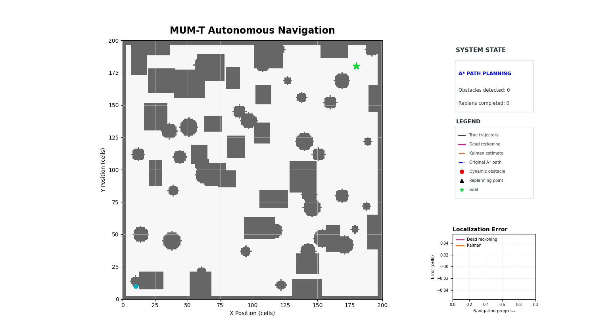
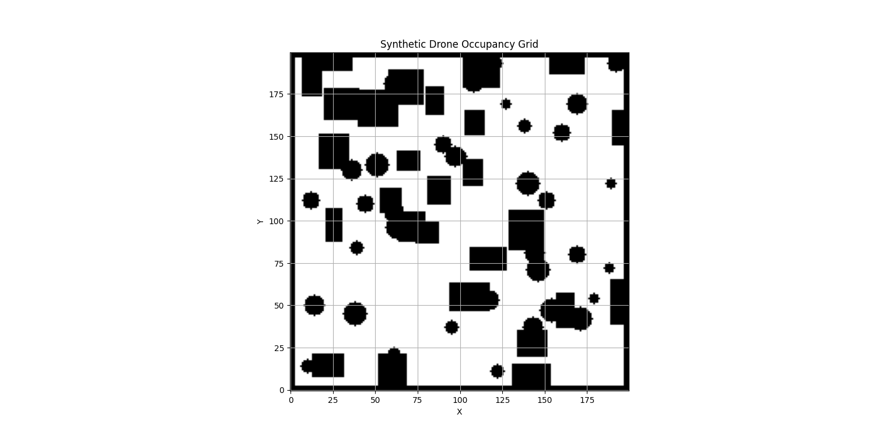
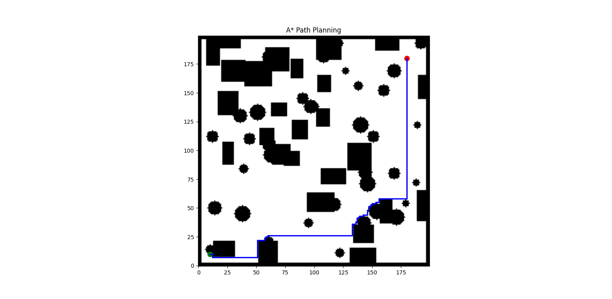
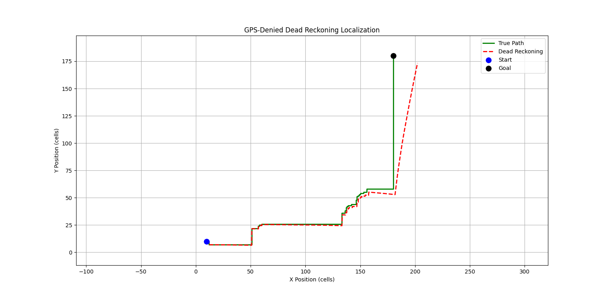
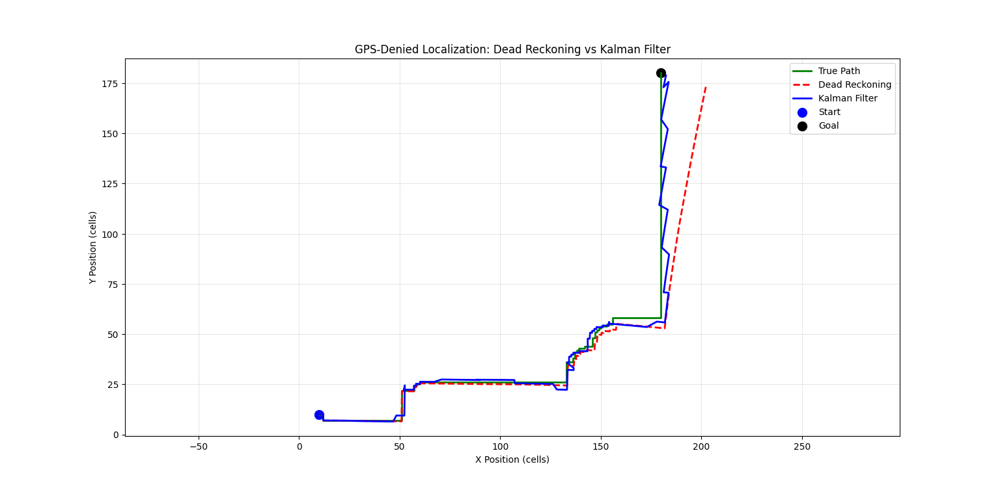
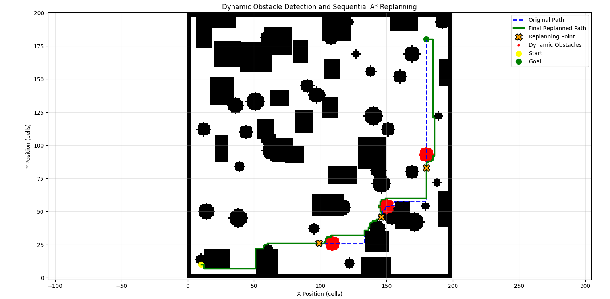

# MUM-T Autonomous Navigation and Dynamic Replanning

A simulation-based autonomous navigation stack for **Manned-Unmanned Teaming (MUM-T)** scenarios, integrating global path planning, localization, state estimation, dynamic obstacle handling, and sequential path replanning.

The project demonstrates how a robot can navigate through a partially occupied environment, estimate its position using dead reckoning and Kalman filtering, respond to dynamically appearing obstacles, replan its route using A*, and ultimately reach its goal without collision.

---

## 🎬 Project Demonstration

### End-to-End Autonomous Navigation



*The animation demonstrates occupancy-grid navigation, A* global planning, robot localization, Kalman filtering, dynamic obstacle detection, sequential replanning, and goal completion.*

---

## 📊 Visual Results

### 1. Occupancy Grid



The generated 2D occupancy grid represents the environment used for autonomous navigation.

### 2. A* Global Path Planning



The A* planner generates an initial collision-free path from the start position to the goal.

### 3. Dead-Reckoning Localization



Dead reckoning estimates the robot position while demonstrating the accumulated localization drift during navigation.

### 4. Kalman Filter Localization



The Kalman filter reduces the localization error by providing a more stable position estimate.

### 5. Dynamic Obstacle Detection and Sequential Replanning



Dynamic obstacles are introduced sequentially, triggering A* replanning to maintain a collision-free route to the goal.

---

## Project Objectives

- Generate a 2D occupancy-grid environment for autonomous navigation.
- Plan an initial collision-free route using the A* algorithm.
- Simulate robot motion along the planned trajectory.
- Demonstrate localization drift using dead reckoning.
- Reduce localization error using a Kalman filter.
- Introduce dynamic obstacles during navigation.
- Detect blockage of the current route.
- Sequentially replan the path from an appropriate point before the obstacle.
- Maintain a collision-free trajectory after replanning.
- Visualize the complete navigation and localization pipeline through an end-to-end animation.

---

## Navigation Pipeline

```text
Synthetic Environment
        │
        ▼
  Occupancy Grid
        │
        ▼
     A* Planner
        │
        ▼
   Planned Path
        │
        ├───────────────┐
        ▼               ▼
Dead Reckoning     Dynamic Obstacle
        │               │
        ▼               ▼
Kalman Filter       Replanning
        │               │
        └───────┬───────┘
                ▼
       Navigation Animation
                │
                ▼
          Goal Reached
```

---

## System Components

### 1. Occupancy Grid

A synthetic 2D occupancy grid represents the navigation environment. Static obstacles are incorporated into the map before global path planning.

---

### 2. A* Global Planner

The A* algorithm generates an initial collision-free path from the start position to the goal.

**Output:**

```text
data/planned_path.npy
```

---

### 3. Dead Reckoning Localization

Dead reckoning estimates the robot's position from its previous state and motion information.

As navigation progresses, accumulated error causes the estimated position to drift away from the true trajectory.

**Output:**

```text
data/dead_reckoning_path.npy
```

---

### 4. Kalman Filter Localization

A Kalman filter processes the dead-reckoning estimate to obtain a more stable position estimate.

The simulation demonstrates the reduction in localization error achieved through filtering.

**Output:**

```text
data/kalman_filtered_path.npy
```

---

### 5. Dynamic Obstacle Detection

Dynamic obstacles are introduced sequentially while the robot is navigating along its current route.

When an obstacle intersects the active path, the system identifies the collision location and determines a suitable replanning point.

---

### 6. Sequential A* Replanning

After a dynamic obstacle blocks the current route, A* is executed again from the replanning position to the goal.

The system supports multiple sequential replanning events rather than a single obstacle-avoidance event.

**Outputs:**

```text
data/dynamic_replanned_path.npy
data/replanning_history.npy
data/replanning_points.npy
```

---

### 7. End-to-End Animation

The final animation combines:

- Occupancy grid
- Original A* path
- True robot trajectory
- Dead-reckoning estimate
- Kalman-filter estimate
- Dynamic obstacles
- Replanning events
- Final goal state
- Localization-error comparison

This provides a visual representation of the complete navigation stack.

---

## Results

The current simulation produced the following results:

### Navigation and Replanning Performance

| Metric | Result |
|---|---:|
| Occupancy grid | 200 × 200 cells |
| Initial A* path points | 347 |
| Original path distance | 346 cells |
| Final replanned path distance | 362 cells |
| Additional distance | 16 cells |
| Dynamic obstacles introduced | 3 |
| Replans triggered | 3 |
| Successful replans | 3 |
| Final path collision | No |
| Goal reached | Yes |

### Localization Performance

| Metric | Dead Reckoning | Kalman Filter |
|---|---:|---:|
| Average error | 5.49 cells | 2.30 cells |
| Final error | 23.25 cells | 2.66 cells |
| Maximum error | 23.25 cells | 5.19 cells |

The Kalman filter achieved:

- **58.10% reduction in average localization error**
- **88.57% reduction in final localization error**

These results demonstrate the benefit of state estimation over uncorrected dead reckoning during navigation.

---

## Project Structure

```text
MUMT_PROJECT/
│
├── data/
│   ├── occupancy_grid.npy
│   ├── planned_path.npy
│   ├── dead_reckoning_path.npy
│   ├── kalman_filtered_path.npy
│   ├── dynamic_replanned_path.npy
│   ├── replanning_history.npy
│   └── replanning_points.npy
│
├── experiments/
│   ├── img_to_grid.py
│   ├── occupancy_grid_real.npy
│   └── replanned_path.npy
│
├── results/
│   ├── 01_occupancy_grid.png
│   ├── 02_a_star_path.png
│   ├── 03_dead_reckoning.png
│   ├── 04_kalman_filter.png
│   ├── 05_dynamic_replanning.png
│   └── 06_mumt_navigation.gif
│
├── src/
│   ├── animation.py
│   ├── kalman_filter.py
│   ├── localization.py
│   ├── planner.py
│   ├── replanner.py
│   └── synthetic_map.py
│
├── README.md
└── requirements.txt
```

The `experiments/` directory contains optional exploratory work, including conversion of a real drone-view image into an occupancy grid and an earlier single-obstacle replanning implementation. These experiments are not required for the main simulation pipeline.

---

## Installation

Clone the repository and navigate to the project directory.

Install the required Python packages:

```bash
pip install -r requirements.txt
```

---

## Requirements

- Python 3.x
- NumPy
- Matplotlib
- OpenCV
- A* Pathfinding

---

## Running the Project

The modules should be executed in the following order because each stage generates data required by the next stage.

### 1. Generate the environment

```bash
python src/synthetic_map.py
```

### 2. Generate the global A* path

```bash
python src/planner.py
```

### 3. Generate the dead-reckoning trajectory

```bash
python src/localization.py
```

### 4. Apply Kalman filtering

```bash
python src/kalman_filter.py
```

### 5. Perform dynamic obstacle detection and replanning

```bash
python src/replanner.py
```

### 6. Run the complete navigation animation

```bash
python src/animation.py
```

---

## Technologies Used

- Python
- NumPy
- Matplotlib
- OpenCV
- A* Pathfinding
- Kalman Filtering
- 2D Occupancy-Grid Mapping
- Autonomous Navigation Simulation

---

## Current Scope

This project currently focuses on simulation and algorithmic validation of the navigation stack.

The implemented pipeline demonstrates global planning, localization, state estimation, dynamic obstacle handling, sequential replanning, and visualization in a 2D environment.

---

## Future Scope

Potential extensions include:

- Closed-loop robot control using real-time state feedback.
- Integration of simulated or real sensor measurements.
- More realistic robot motion and kinematic constraints.
- Real-time obstacle detection.
- Improved dynamic-obstacle prediction.
- Integration with ROS / ROS 2.
- Hardware or robotic-platform deployment.
- Multi-agent MUM-T coordination.
- Integration with aerial and ground robotic platforms.